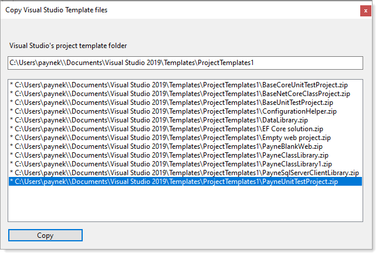

# About 

Iteration 2 for copying local Visual Studio project templates from a local folder to Visual Studio project templates folder

User's project template folder

```
C:\Users\xxxxxx\Documents\Visual Studio 2019\Templates\ProjectTemplates
```

`xxxxxx` is replaced with

```csharp
public static string TemplateFolder => $"{Environment.GetFolderPath(Environment.SpecialFolder.UserProfile)}\\{TemplatePath()}";
```

Using appsettings.json

```json
{
  "TemplateFolder": "\\Documents\\Visual Studio 2019\\Templates\\ProjectTemplates1",
  "Developer": "Karen Payne"
}
```

**Notes** 

- `ProjectTemplates1` is for testing while for actual use `ProjectTemplates` is the proper folder. Which means if a developer wants to test set `TemplateFolder` to `ProjectTemplates1` so not to distrub current templates.
- In the master branch the path for tempate folder was hard coded which means any time changes are made while under testing must be changed and recomplied for use else code will not throw an exception but will not allow code to run.


### Screenshot after running
       
